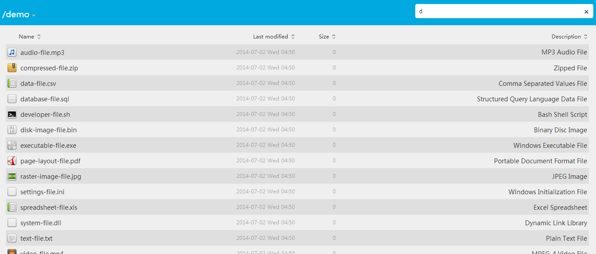

BeautifulApacheDirectoryList
============================

美化apache默认的文件索引列表

###1. 下载

'''
直接checkout本项目即可
'''

###2. 配置

'''
- 1、在apache的http.conf文件中引入本项目中的httpd-autoindex.conf，如果本来已经引入，可以考虑直接修改，或者重名名本文件，再引入

- 2、将本项目下的.theme文件夹传到htdocs目录，保证可以被访问到，然后修改httpd-autoindex.conf第3、4行，把对应路径修改好

- 3、重启apache服务
'''

###3. 自定义样式
------------

'''
修改本项目下的.theme\style.css文件即可
'''